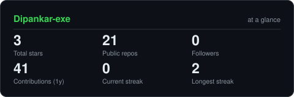
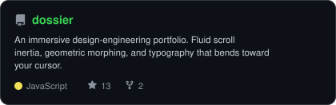
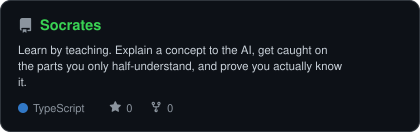

<div align="center">

<!-- PORTRAIT - generated by scripts/dotify.py from assets/my_photo.png.
     Colour mode, so one file serves both GitHub themes. Regenerate with:
       python scripts/dotify.py assets/my_photo.png -o assets/portrait \
         --cols 100 --equalize --detail 0.5 --color --reveal -->


<br>

<!-- NAME / TAGLINE - animated typing -->
<a href="https://github.com/Dipankar-exe">
  
</a>

<br>

<!-- SOCIALS -->
<a href="https://www.linkedin.com/in/dipankar-roy-57a4a432b/"></a>
<a href="mailto:dipankarroy.bpc@gmail.com"></a>
<a href=""></a>
<a href="https://www.instagram.com/mr._.dipankar/"></a>


</div>

---

## `~/` whoami

```console
$ cat about.txt
```

Hi, I'm **Dipankar Roy**. I'm a Computer Science student and developer passionate about building useful applications across the web and mobile, with a growing interest in AI and intelligent systems.

- Building web, mobile, and AI-powered applications
- Working with React, Next.js, Node.js, Express.js, MySQL, MongoDB, and React Native
- Exploring AI/ML, APIs, backend systems, and modern application development
- 🏆 Hackathon participant who loves turning ideas into working prototypes
- Fun fact: I usually start with an idea and end up turning it into a project.

<br>

<div align="center">

## `~/` toolbox

### Languages
`C++` `Python` `Java` `JavaScript` `TypeScript`

### Frontend
`React` `Next.js` `React Native` `Tailwind CSS`

### Backend
`Node.js` `Express.js` `REST API` `WebSockets`

### Database
`MySQL` `MongoDB` `Prisma`

### AI / ML
`OpenCV` `YOLO` `Ollama`

### Tools
`Git` `GitHub` `VS Code` `Postman` `Puppeteer` `Monaco Editor`

<br>


</div>

---

<div align="center">

## `~/` skill radar

<table>
<tr>
<td width="50%" align="center" valign="middle">

<!-- Self-rated radar - edit assets/skills.json, the workflow redraws it -->
<picture>
  <source media="(prefers-color-scheme: dark)"  srcset="assets/radar-dark.svg">
  <source media="(prefers-color-scheme: light)" srcset="assets/radar-light.svg">
  
</picture>

</td>
<td width="50%" align="center" valign="middle">

<!-- Live radar built from real language byte counts across your repos -->
<picture>
  <source media="(prefers-color-scheme: dark)"  srcset="assets/radar-langs-dark.svg">
  <source media="(prefers-color-scheme: light)" srcset="assets/radar-langs-light.svg">
  
</picture>

</td>
</tr>
</table>

</div>

---

<div align="center">

## `~/` contribution calendar

<!-- 3D isometric calendar, regenerated every 6h by .github/workflows/metrics.yml -->


<br><br>

<!-- Snake eats the contribution graph - .github/workflows/snake.yml -->
<picture>
  <source media="(prefers-color-scheme: dark)"  srcset="https://raw.githubusercontent.com/Dipankar-exe/Dipankar-exe/output/snake-dark.svg">
  <source media="(prefers-color-scheme: light)" srcset="https://raw.githubusercontent.com/Dipankar-exe/Dipankar-exe/output/snake.svg">
  
</picture>

</div>

---

<div align="center">

## `~/` the numbers

<!-- Generated by scripts/cards.py into this repo. Deliberately NOT
     github-readme-stats / streak-stats / github-profile-trophy: those are
     shared public instances that go down and take the whole section with them. -->
<picture>
  <source media="(prefers-color-scheme: dark)"  srcset="assets/card-stats-dark.svg">
  <source media="(prefers-color-scheme: light)" srcset="assets/card-stats-light.svg">
  
</picture>

<br>


<br><br>


</div>

---

<div align="center">

## `~/` selected work

<!-- Cards generated by scripts/cards.py from assets/projects.json.
     Stars, forks and language are pulled live from the API on every run. -->
<table>
<tr>
<td width="50%">
  <a href="https://github.com/Dipankar-exe/<YOUR_PROJECT_1>">
    <picture>
      <source media="(prefers-color-scheme: dark)"  srcset="assets/card-dossier-dark.svg">
      <source media="(prefers-color-scheme: light)" srcset="assets/card-dossier-light.svg">
      
    </picture>
  </a>
</td>
<td width="50%">
  <a href="https://github.com/Dipankar-exe/<YOUR_PROJECT_2>">
    <picture>
      <source media="(prefers-color-scheme: dark)"  srcset="assets/card-Sage-dark.svg">
      <source media="(prefers-color-scheme: light)" srcset="assets/card-Sage-light.svg">
      
    </picture>
  </a>
</td>
</tr>
<tr>
<td width="50%">
  <a href="https://github.com/Dipankar-exe/<YOUR_PROJECT_3>">
    <picture>
      <source media="(prefers-color-scheme: dark)"  srcset="assets/card-Socrates-dark.svg">
      <source media="(prefers-color-scheme: light)" srcset="assets/card-Socrates-light.svg">
      
    </picture>
  </a>
</td>
<td width="50%">
  <a href="https://github.com/Dipankar-exe/<YOUR_PROJECT_4>">
    <picture>
      <source media="(prefers-color-scheme: dark)"  srcset="assets/card-humanOS-dark.svg">
      <source media="(prefers-color-scheme: light)" srcset="assets/card-humanOS-light.svg">
      
    </picture>
  </a>
</td>
</tr>
</table>

<sub>

| project | live | stack |
|---|---|---|
| **[project-1](https://github.com/Dipankar-exe/<YOUR_PROJECT_1>)** | `<LIVE_URL>` | `React` `Node.js` |
| **[project-2](https://github.com/Dipankar-exe/<YOUR_PROJECT_2>)** | `<LIVE_URL>` | `Next.js` `TypeScript` |
| **[project-3](https://github.com/Dipankar-exe/<YOUR_PROJECT_3>)** | `<LIVE_URL>` | `React Native` |
| **[project-4](https://github.com/Dipankar-exe/<YOUR_PROJECT_4>)** | `<LIVE_URL>` | `Python` `AI/ML` |

</sub>

</div>

---

<div align="center">

<sub>`01110100 01101000 01100001 01101110 01101011 01110011 00100000 01100110 01101111 01110011 00100000 01110011 01100011 01110010 01101111 01101100 01101100 01101001 01101110 01100111`</sub>

</div>
